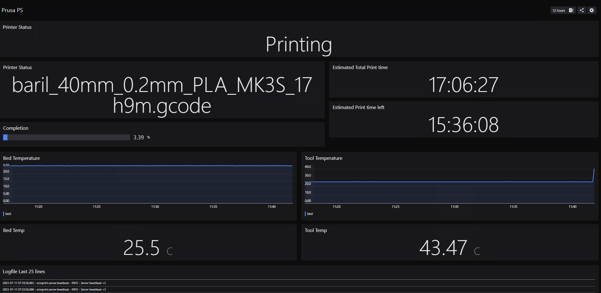
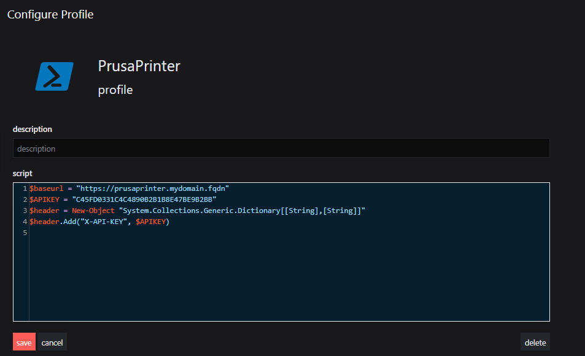
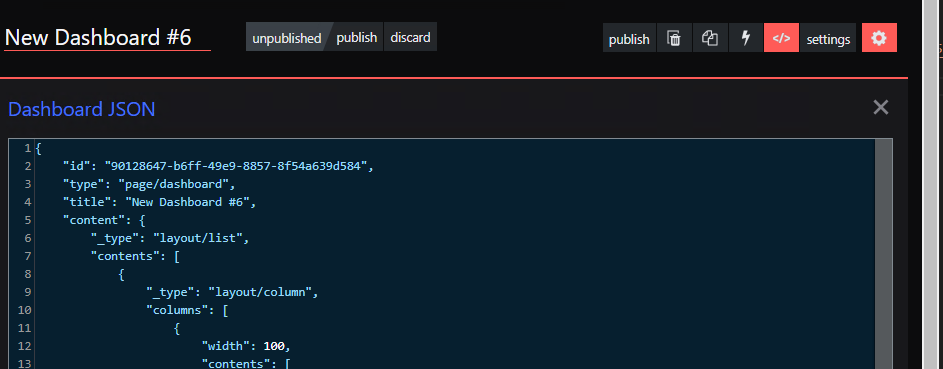

# OctoPrint Dashboard
This dashboard pulls information from the REST API in OctoPrint to show you printer status, progress and temperature information on your printer.
The dashboard utilizes PowerShell scripts to connect to the REST API and to do data conversion on the temperature data.

# PowerShell Profile
This dashboard uses the PowerShell profile to set up the url and API Key for your OctoPrint instance.

# Steps to import dashboard

## PowerShell profile
Create a new profile with the following information:

`$baseurl = "https://youroctorprinturl"`

`$APIKEY = "your-api-key"`

`$header = New-Object "System.Collections.Generic.Dictionary[[String],[String]]"`

`$header.Add("X-API-KEY", $APIKEY)`

## Create dashboard
To create the dashboard you need to create a new dashboard and copy the JSON code from [Octoprint.json](Octoprint.json) into the dashboard.

## Edit interval and timeout
Remember to edit the interval to make sure you dont hammer the webservice on octoprint and ruin your print.

## Further documentation

Follow this guide to find your API key for OctoPrint:

[How to find my OctoPrint api key](https://docs.octoprint.org/en/master/api/general.html#authorization)

[OctoPrint API Documentation](https://docs.octoprint.org/en/master/api/index.html)

