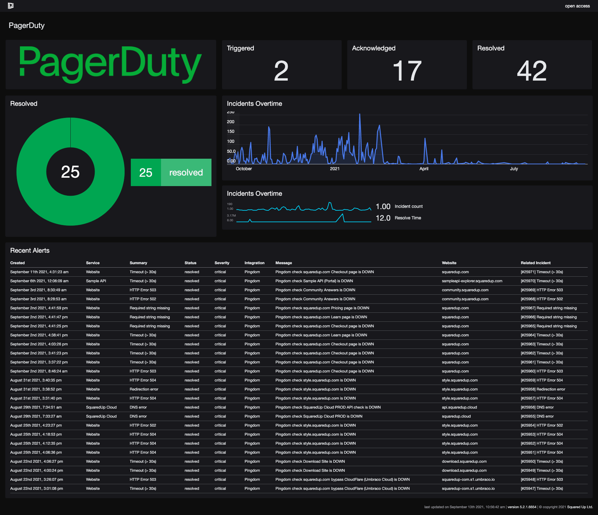
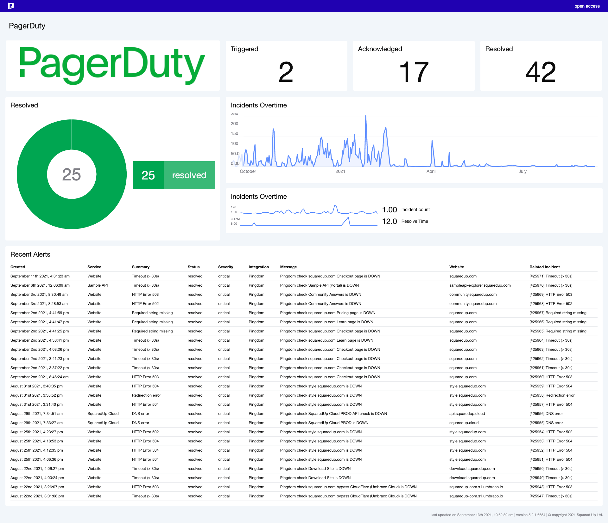

# PagerDuty Dashboard
This dashboard gives an overview of incidents and alerting from PagerDuty

- Resolved – Summary donut - Resolved incidents
- Triggered, Acknowledged, Resolved – Scalar – Insight into the current incidents of each priority
- Incidents Over Time – Line and Sparkline - Time series showcasing incidents over a time span (customizable and can use Page Timeframe)
- Recent Alerts – Grid – List of recent alerts (customizable and can use Page Timeframe). Also displays which integration alert has been triggered from 


## How to use this dashboard
### PagerDuty Logo
- The images folder needs to exist specifically in the IIS root i.e. C:\inetpub\wwwroot and the structure of \logos\ should be maintained (or the dashboard JSON updated to suit)
- Copy the [PagerDuty-GreenRGB-599x123-b832f3c.png](Images/PagerDuty-GreenRGB-599x123-b832f3c.png) logo from the images folder in the repo to this folder
### Setup a Web API integration
- Navigate to System > Integrations
- Create new WebAPI integration, using Simple auth, called "PagerDuty"
- Enter base url for the PagerDuty API i.e. https://api.pagerduty.com/
- Add the authorization default header with your token i.e. ```Token token=jaskdjASdjhasdk```


### Setup the dashboard
- Copy the JSON from this project
- Create a new dashboard, select the </> on the top right and paste the content of the .json and click **Apply Changes**.
- Dashboard should display as shown below, with high level insight into the Incidents and Alerting from your PagerDuty instance
  



