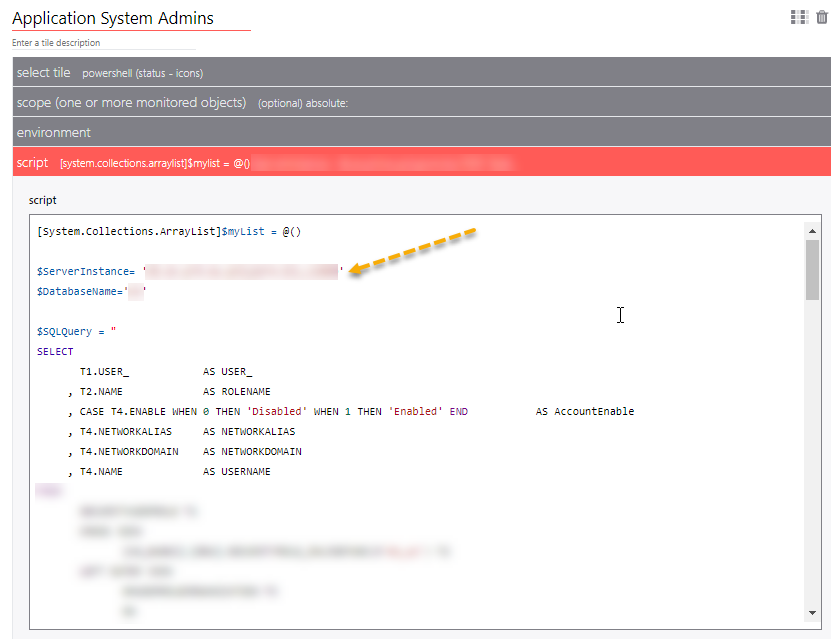
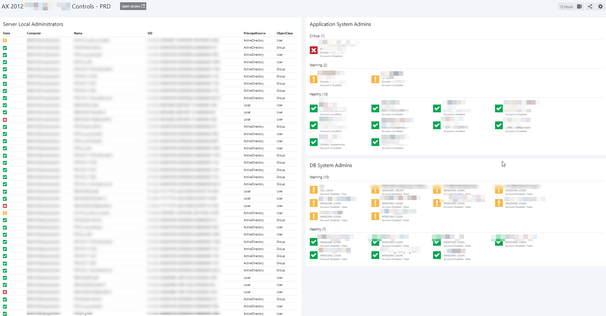

# IT Security Controls Audit Dashboard
This dashboard gives a quick way to identify Non compliant controls for accounts with high privileges. 

For each scoped applications you will see :	
- Server controls (local Administrators)
- Application Controls (application level system admins)
- DB controls (Database level controls)

## How to use this dashboard
### Setup a PowerShell profile
- Navigate to System > PowerShell
- Create new "Audit" Profile with some variables

### Setup the dashboard
- Copy the JSON from [dashboard.json](dashboard.json) in this project
- Create a new dashboard, select the </> on the top right and paste the content of the .json and click **Apply Changes**.
- For each tile check the PowerShell script to update some DB connection strings and SQL queries to list Admins from an application

- Once all the the tiles are working for your needs, click **Publish** and you're done!

> **NOTE:**  Based on the fields retrieved by your SQL query you would need to adapt the PowerShell script as well
  

-  - Red (Critical) -  means there is an issue and the account in red should not have Admins rights
-  - Orange (Warning)  - for IT to review, might be a reason for temporary Admin rights
-  - Green (Healthy) - all good :) 

