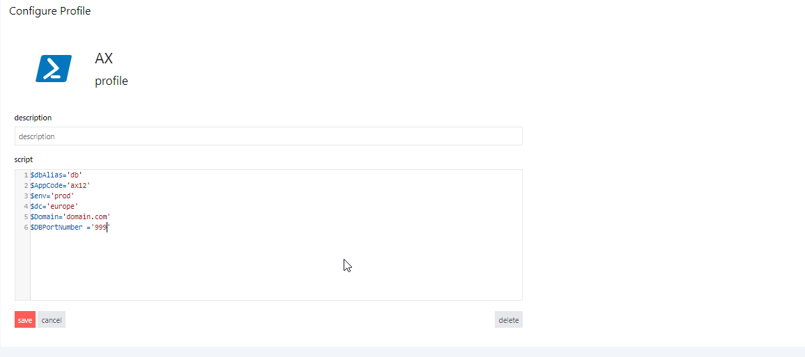
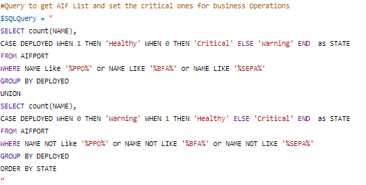
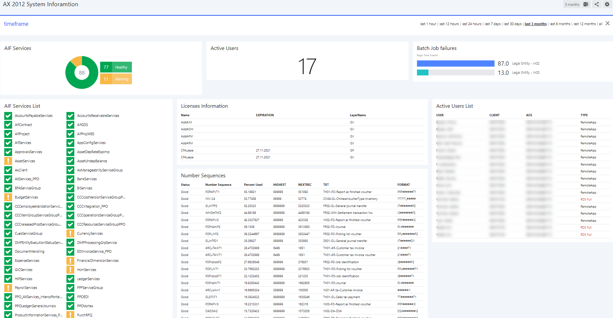

# Microsoft Dynamics AX 2012 - System Information Dashboard 

Our need was to get all needed System information to help in our ERP System monitoring 	
- AIF Services health and list
- Number of active Users connected to the application
- Licenses control / expiration
- Number sequences for invoices, PRs and others to be monitored
- Last batch job failures based on page timeframe
- Users list details like client computer source, Application Object Server (AOS) where the users are connected 

## How to use this dashboard

### Setup a PowerShell Profile 
- Navigate to System > PowerShell
- Create new "AX" Profile with some variables to query your ERP System Database

### Setup the dashboard
- Copy the JSON from this project
- Create a new dashboard, select the </> on the top right and paste the content of the .json and click **Apply Changes**.
> **NOTE:**  Based on the fields retrieved by your SQL query you would need to adapt the PowerShell script as well
  

- Once all the  tiles are working for your needs, click **Publish** and you're done!

## AX2012 System Information Dashboard (works for other ERP Systems as well!)

