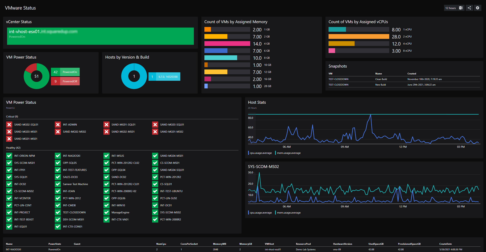
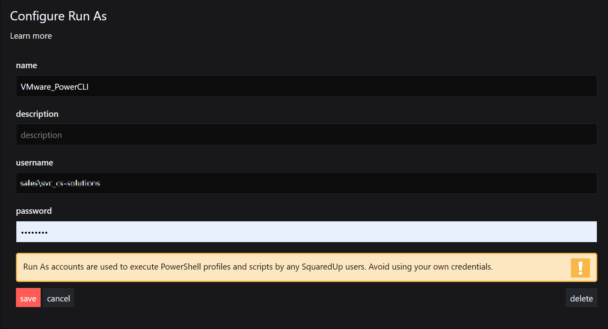

# VMware Status #

This dashboard is a proof of concept on how to use VMware's PowerShell PowerCLI to quickly create dashboards. 

## Requirements ##
In order to use this dashboard, you are required to take several steps:

1. Install VMware's PowerCLI on the server hosting SquaredUp Dashboard Server.
2. Create a SquaredUp PowerShell Profile.
3. Create a Run As account and associated it with a SquaredUp Run As account.
4. Copy the VMware Status JSON to a new dashboard.

## Images ##

When finished, your dashboard should look similar to this:

## Dashboard Breakdown ##

### Create a SquaredUp Profile ###

Create a SquaredUp profile with the following script called `VMwarePowerCLI`.

1. Copy the contents of the PowerShell *profile.ps1* file from GitHub.
2. In SquaredUp, click the hamburger menu in the upper right corner.
3. Click on *System*.
4. Go to the *PowerShell* tab.
5. In the Profile section, click on the **+** button to add a new Profile.
6. Enter a profile name of *VMwarePowerCLI*.
7. (Optional) Supply a description of *Sets up the PowerShell Profile and connects to a vCenter Server.*.
8. Paste the contents of the clipboard into the script box.
9. Change the values for the parameters `$User`, `$Pass`, `$vCenter`, `$VM` and `$vmHost` 
9. Click save to save the new profile.

Your finished profile should look like this:

	
If you need more assistance, please check out this SquaredUp KB article:  [How to configure a PowerShell profile](https://support.squaredup.com/hc/en-us/articles/4402410306065-How-to-use-the-PowerShell-tile#:~:text=to%20your%20script.-,How%20to%20configure%20a%20PowerShell%20profile,-Click%20the%20hamburger)

### Create a Run As Account###

Create a SquaredUp Run As account called *VMware_PowerCLI*.

1. In SquaredUp, click the hamburger menu in the upper right corner.
1. Click on *System*. 
1. Go to the *PowerShell* tab.
1. In the Run As section, click on the `+` button to add a new Run As.
1. Enter a name of *VMware_PowerCLI*.
1. Enter the user credentials you want to use for this Run As account.
1. Click save to save the new Run As account.

Your finished Run As should look like this:

If you need more assistance, please check out this SquaredUp KB article:  [Managing PowerShell Run As accounts](https://support.squaredup.com/hc/en-us/articles/4402410306065-How-to-use-the-PowerShell-tile#:~:text=a%20safe%20place.-,Managing%20PowerShell%20Run%20As%20accounts,-PowerShell%20scripts%20are)

### Create the VMware Status Dashboard ###

1. Copy the contents of the JSON *[vmware-status.json](vmware-status.json)* file from GitHub
1. In SquaredUp, create a new dashboard.
1. Select the </> on the top right to open the JSON editor.
1. Paste the contents of the copied file from GitHub into SquaredUp.
1. Click *Apply* Changes
2. Lastly, click the 'Publish' button.
