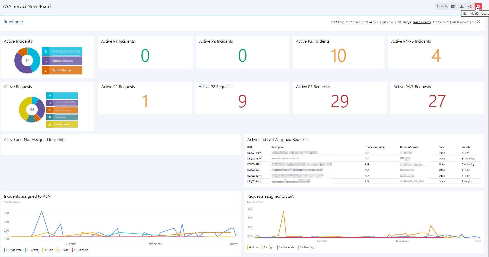
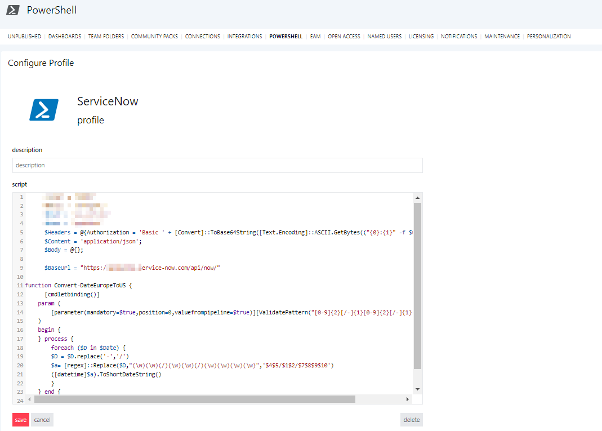
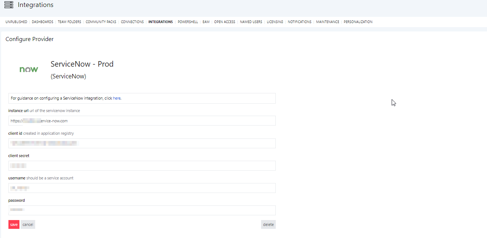
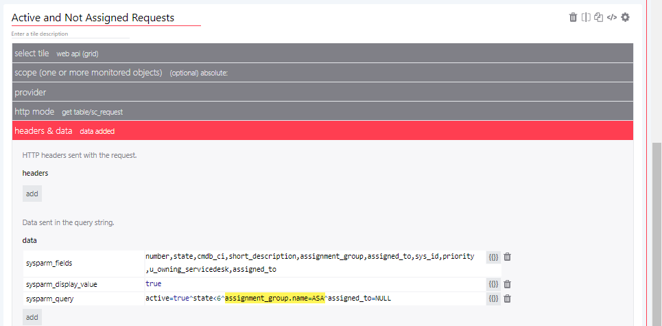
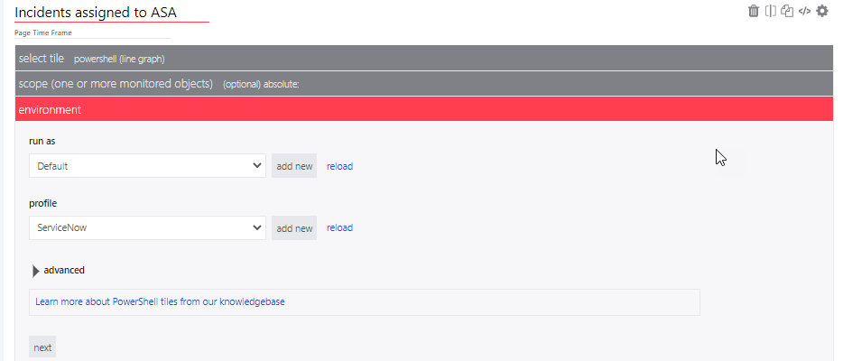
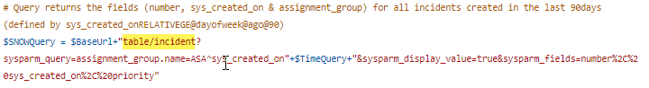
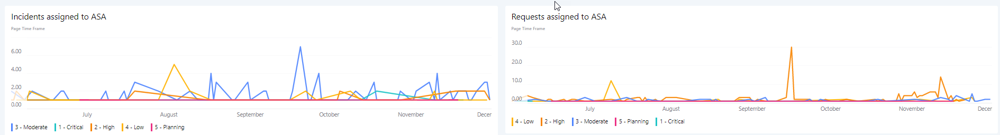

# ServiceNow Board
This is a SquaredUp Dashboard that computes WebAPI for ServiceNow and PowerShell to query ServiceNow API.

In our continous improvement to have a "Single Pane of Glass" entry point, we created some ServiceNow Dashboards per teams to have a quick view of current Incidents / Requests / Changes / Problems.

## How to use this dashboard

### Setup a PowerShell Profile 
- Navigate to System > PowerShell
- Create new "ServiceNow" Profile as per below

` $User = 'ServiceNowUser'` 
` $Pass = 'Password'`      
` $Headers = @{Authorization = 'Basic ' + [Convert]::ToBase64String([Text.Encoding]::ASCII.GetBytes(("{0}:{1}" -f $user, $pass)))}`
` $Content = 'application/json';`
` $Body = @{};`
     
` $BaseUrl = "https://<YourInstance>.service-now.com/api/now/"`

> **NOTE:**  The function PowerShell **"Convert-DateEuropeToUS"** might not be needed. We have our ServiceNow instance in Europe but our SquaredUp Server in the US. 

### Setup a ServiceNow API Integration 

Check out the [How To Setup Web API Tile with ServiceNow](https://support.squaredup.com/hc/en-us/articles/4406616264721-How-to-use-the-Web-API-tile-with-ServiceNow)

> **NOTE:**  You can name it **"ServiceNow - Prod"** to ease the JSON copy/paste :)

### Setup the dashboard
- Copy the JSON code from [ServiceNow-Board.json](ServiceNow-Board.json)
- Create a new dashboard, select the </> on the top right and paste the content of the .json and click **Apply Changes**.

### Update WebAPI Tiles

- For each WebAPI tiles you might need to adapt your ServiceNow Queries. In that example I'm retrieving only Incidents and Requests for one specifc group.
- Replace "table/incident" with :

`table/sc_request`  --> Requests
`table/change_request`  --> Changes
`table/problem`  --> Problems
`table/cmdb_ci_hyper_v_instance` --> VMs 
etc... 

### Update PowerShell Tiles

- Select the ServiceNow profile created earlier

- Update the SNOWQuery in the [ServiceNowIncidents.ps1](ServiceNowIncidents.ps1) based on your needs. *Thanks to SquaredUp support for helping me with the PowerShell!*

- Once all the  tiles are working per your needs, click **Publish** and you're done!

> **NOTE:**  PowerShell Line graph are Page Time frame based !

